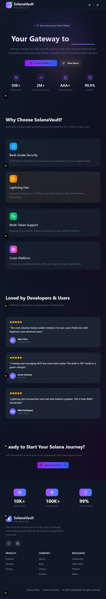

# Next.js Solana Web3 Application

A modern, feature-rich Next.js application for interacting with the Solana blockchain. This dApp provides a comprehensive set of tools for managing Solana tokens, NFTs, and performing various on-chain operations through an intuitive and responsive interface.

## 📋 Table of Contents
1. 🔗 [Live Demo](#livedemo)
2. 📱 [Features](#features)
3. ⚙️ [Tech Stack](#tech-stack)
4. 🚀 [Installation](#installation)****
5. 🖥️ [Application Structure](#app-structure)
6. 🛠️ [Environment Setup](#env)

## <a name='livedemo'>[🔗LiveDemo](https://solanavalut.vercel.app) </a>


## <a name="features">📱 Features</a>

- **Wallet Integration** - Secure connection with popular Solana wallets
- **Token Management** - Create, transfer, and manage SPL tokens
- **NFT Operations** - Mint, verify, and view NFTs with collection support
- **Account Reading** - View detailed information about any Solana account
- **SOL Transfers** - Send and receive SOL with transaction history
- **CRUD Operations** - Interact with Solana programs for data storage
- **Memo Program** - Send on-chain messages using Solana's Memo program
- **Devnet Support** - Built-in airdrop functionality for testing
- **Responsive Design** - Beautiful UI that works across all devices
- **Dark Mode** - Full light/dark theme support

## <a name="tech-stack">⚙️ Tech Stack</a>

### Frontend
- Next.js 15 (App Router)
- React 19
- TailwindCSS 4
- Framer Motion
- TypeScript
- Shadcn UI Components
- Sonner (Toast notifications)
- Lucide React (Icons)

### Blockchain
- @solana/web3.js - Solana JavaScript API
- @solana/wallet-adapter - Wallet connection utilities
- @solana/spl-token - Token operations
- @metaplex-foundation/js - NFT and metadata operations
- @coral-xyz/anchor - Framework for Solana program interactions

## <a name="installation">🚀 Installation</a>

1. Clone and Install:
```bash
git clone https://github.com/yourusername/Solana-Vault.git
cd next-solana-app
npm install
```

2. Start Development:
```bash
npm run dev
```

3. Open [http://localhost:3000](http://localhost:3000) with your browser to see the application.

## <a name="app-structure">🖥️ Application Structure</a>

### Dashboard
The central hub providing access to all application features and displaying account balance and transaction history.

### SPL Token Studio
A comprehensive interface for token operations:
- **My Tokens** - View and manage your created and owned tokens
- **Create Token** - Deploy new SPL tokens with custom metadata
- **Operations** - Mint, transfer, and burn tokens
- **Advanced** - Token approvals and delegation functionality

### NFT Studio
A complete NFT management system:
- **My NFTs** - View and manage your NFTs and collections
- **Create Collection** - Create a new NFT collection
- **Create NFT** - Mint a new NFT with optional collection assignment
- **Verify NFT** - Verify NFT membership in a collection

### Contract Interactions
Various tools for interacting with Solana's native and other programs:
- **Account Reader** - View detailed information about any Solana account
- **Transfer SOL** - Send SOL to other wallets
- **Memo** - Send on-chain messages
- **CRUD** - Create, read, update, and delete data on-chain

## <a name="env">🛠️ Environment Setup</a>

Create a `.env.local` file in the root directory with the following variables:
```bash
- NEXT_PUBLIC_RPC_ENDPOINT 
- NEXT_PUBLIC_CLUSTER
- NEXT_PUBLIC_PINATA_API_KEY
- NEXT_PUBLIC_PINATA_SECRET_KEY
- NEXT_PUBLIC_PINATA_JWT

```


## Building for Production

```bash
npm run build
npm run start
```


